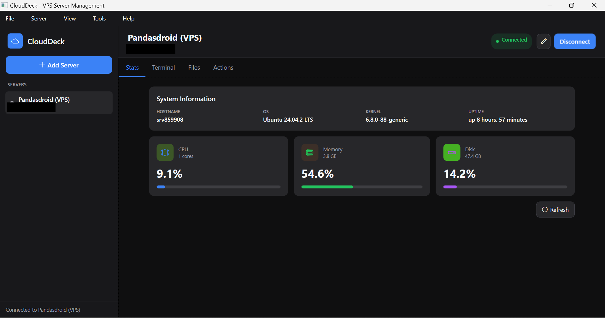
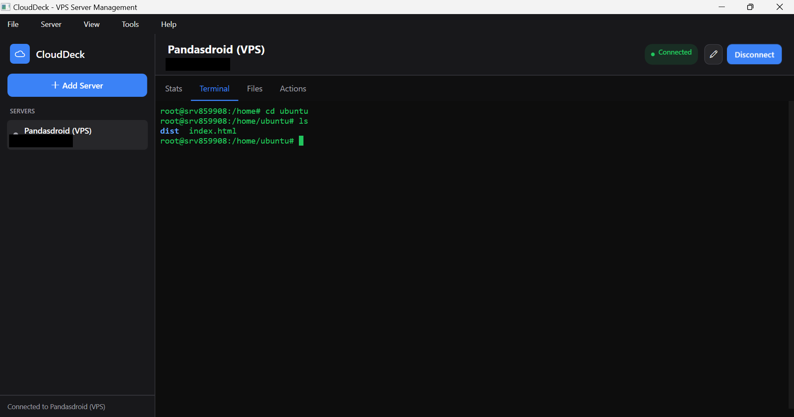
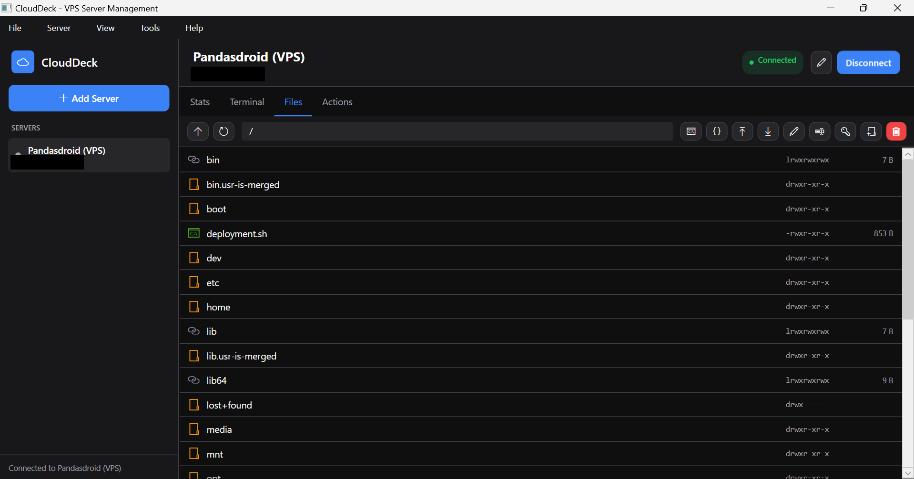
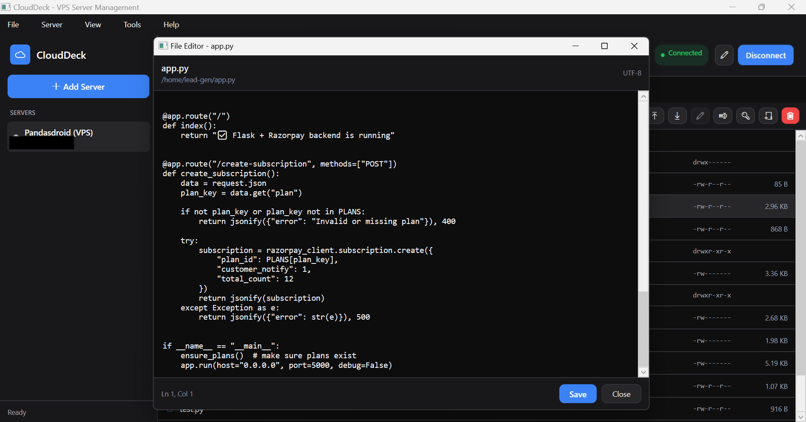
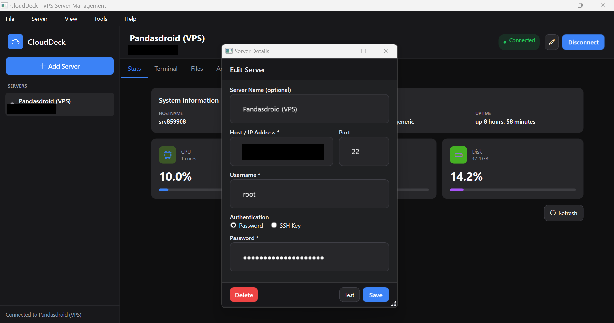
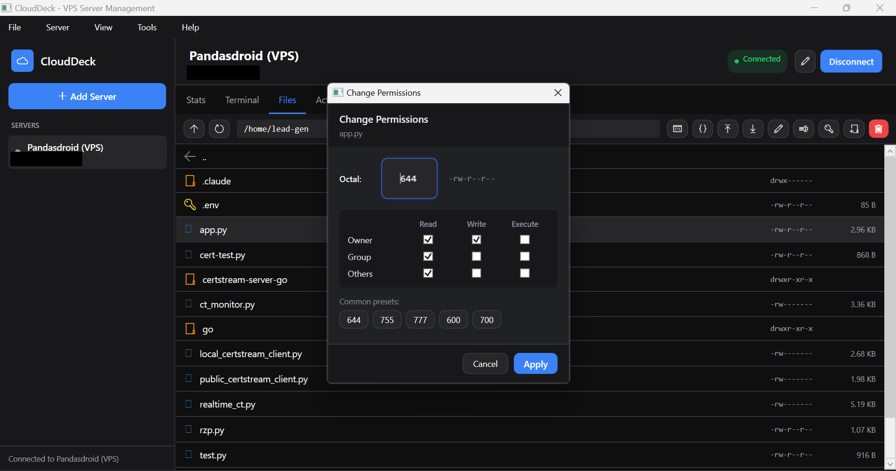
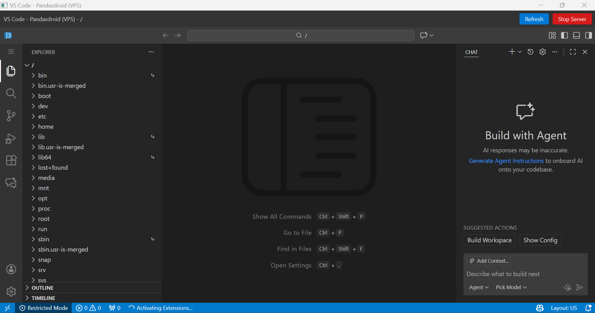

# CloudDeck

**Professional VPS Server Management Tool**

A modern Windows desktop application for managing VPS servers with SSH terminal, SFTP file manager, and VS Code integration.

Developed by **Pandasdroid Pvt Ltd**

---

## Features

- **SSH Terminal** - Full-featured terminal with xterm.js, copy/paste support, and color output
- **SFTP File Manager** - Browse, upload, download, edit, rename, and manage remote files
- **VS Code Integration** - Open remote directories in code-server directly from the app
- **Server Statistics** - Real-time CPU, memory, disk usage, and system information
- **Multi-Server Management** - Add, edit, delete, import/export server configurations
- **Private Key Authentication** - Support for password and SSH key authentication
- **Dark Theme UI** - Modern, clean interface with smooth animations

---

## Screenshots

### Dashboard & Server Statistics

*Real-time server monitoring with CPU, memory, and disk usage*

### SSH Terminal

*Full-featured terminal with xterm.js, color support, and command history*

### SFTP File Manager

*Browse, upload, download, and manage remote files with ease*

### File Editor

*Edit text files directly on the server with syntax highlighting*

### Server Configuration

*Add and configure servers with password or SSH key authentication*

### File Permissions

*Change file permissions with intuitive checkbox interface*

### VS Code Integration

*Full VS Code experience via code-server with complete filesystem access*

---

## Requirements

- Windows 10/11 (64-bit)
- .NET 8.0 Runtime
- WebView2 Runtime (usually pre-installed on Windows 10/11)

For VS Code integration on servers:
- code-server installed on the remote server

---

## Installation

### Option 1: Build from Source

1. Clone the repository
2. Open in Visual Studio 2022 or run:
   ```
   dotnet restore
   dotnet build
   ```
3. Run the application:
   ```
   dotnet run
   ```

### Option 2: Download Release

Download the latest release from the releases page.

---

## Usage

### Adding a Server

1. Click **Add Server** button or go to **File > Add Server**
2. Enter server details:
   - **Name** - Display name for the server
   - **Host** - Server IP address or hostname
   - **Port** - SSH port (default: 22)
   - **Username** - SSH username
   - **Authentication** - Password or Private Key
3. Click **Save**

### Connecting to a Server

1. Select a server from the sidebar
2. Click **Connect** button
3. Once connected, you can:
   - View server stats in the **Stats** tab
   - Use the terminal in the **Terminal** tab
   - Browse files in the **Files** tab
   - Perform server actions in the **Actions** tab

### File Manager

- **Double-click** folders to navigate
- **Double-click** files to edit (text files only)
- Use toolbar buttons for:
  - Upload/Download files
  - Create folders
  - Rename/Delete files
  - Change permissions
  - Open in VS Code

### VS Code Integration

1. Connect to a server
2. Navigate to the desired directory in Files tab
3. Click the **VS Code icon** in the toolbar
4. code-server will start on the remote server
5. VS Code opens in a new window via SSH tunnel

**Note:** code-server must be installed on the server:
```bash
curl -fsSL https://code-server.dev/install.sh | sh
```

### Import/Export Servers

- **File > Import Servers** - Import from JSON file
- **File > Export Servers** - Export to JSON file

---

## Architecture

### Project Structure

```
CloudDeck/
├── Assets/
│   └── terminal.html       # xterm.js terminal HTML
├── Controls/
│   └── TerminalControl     # WebView2-based terminal control
├── Converters/
│   └── Converters.cs       # WPF value converters
├── Fonts/
│   ├── codicon.ttf         # VS Code icons
│   └── devicon.ttf         # Programming language icons
├── Models/
│   └── Server.cs           # Server and FileItem models
├── Services/
│   ├── SshService.cs       # SSH/SFTP operations
│   └── StorageService.cs   # Local data persistence
├── ViewModels/
│   └── MainViewModel.cs    # Main application logic (MVVM)
├── Views/
│   ├── AboutDialog         # About window
│   ├── FileEditorDialog    # Text file editor
│   ├── InputDialog         # Generic input dialog
│   ├── PasswordDialog      # Password input dialog
│   ├── PermissionsDialog   # File permissions editor
│   ├── ServerDialog        # Add/Edit server dialog
│   └── VSCodeWindow        # VS Code integration window
├── App.xaml                # Application resources and styles
├── MainWindow.xaml         # Main application window
└── VPSManager.csproj       # Project configuration
```

### Technology Stack

- **Framework:** .NET 8.0 / WPF
- **UI Pattern:** MVVM (Model-View-ViewModel)
- **SSH Library:** SSH.NET
- **Terminal:** xterm.js via WebView2
- **VS Code:** code-server via SSH tunnel
- **MVVM Toolkit:** CommunityToolkit.Mvvm

### Key Components

**SshService**
- Manages SSH connections using SSH.NET library
- Handles shell sessions for terminal
- Executes remote commands
- SFTP operations (upload, download, list, delete)
- Maintains connection pool for multiple servers

**StorageService**
- Persists server configurations to JSON
- Stores data in `%AppData%/VPSManager/servers.json`
- Handles import/export functionality

**TerminalControl**
- WebView2-based terminal emulator
- Uses xterm.js for rendering
- Bidirectional communication with SSH shell
- Supports copy/paste, colors, and resize

**VSCodeWindow**
- Establishes SSH tunnel to remote code-server
- Uses consistent port per server for session persistence
- Handles OAuth popups for extensions requiring login
- Preserves code-server session between window opens

**MainViewModel**
- Central application logic
- Server management (CRUD operations)
- Connection state management
- File operations coordination
- Statistics polling

### Data Flow

1. **User Interface** (XAML Views) binds to **ViewModel** properties
2. **ViewModel** calls **Services** for operations
3. **SshService** communicates with remote servers via SSH.NET
4. **StorageService** persists data locally
5. Changes notify UI via INotifyPropertyChanged

### Authentication

- **Password:** Stored in memory only, never persisted
- **Private Key:** Path stored, key loaded on connect
- Supports OpenSSH and PuTTY key formats

---

## Configuration

Server data is stored at:
```
%AppData%/VPSManager/servers.json
```

VS Code settings on remote servers:
```
~/.code-server/data/       # User data and settings
~/.code-server/extensions/ # Installed extensions
```

---

## Keyboard Shortcuts

| Shortcut | Action |
|----------|--------|
| Ctrl+N | Add new server |
| F5 | Refresh files |
| Ctrl+C | Copy / Cancel command |
| Ctrl+V | Paste |
| Ctrl+L | Clear terminal |
| Enter | Open file/folder |
| Delete | Delete selected file |
| F2 | Rename file |
| Alt+F4 | Exit application |

---

## Troubleshooting

### Connection Failed
- Verify server IP/hostname is correct
- Check SSH port (default 22)
- Ensure firewall allows SSH connections
- Verify credentials are correct

### Terminal Not Working
- WebView2 runtime may need installation
- Check if SSH shell session is active
- Try reconnecting to the server

### VS Code Not Loading
- Ensure code-server is installed on the server
- Check if port is available (not blocked by firewall)
- View logs at `/tmp/code-server-{port}.log` on server

### File Operations Slow
- Large files may take time over SSH
- Check network connection quality
- Consider using compression for large transfers

---

## License

Copyright © 2025 Pandasdroid Pvt Ltd. All rights reserved.

---

## Support

For custom development, enterprise licensing, or support inquiries:

**Email:** business@pandasdroid.com

**GitHub:** [github.com/pandasdroid/vps-management](https://github.com/pandasdroid/vps-management)
